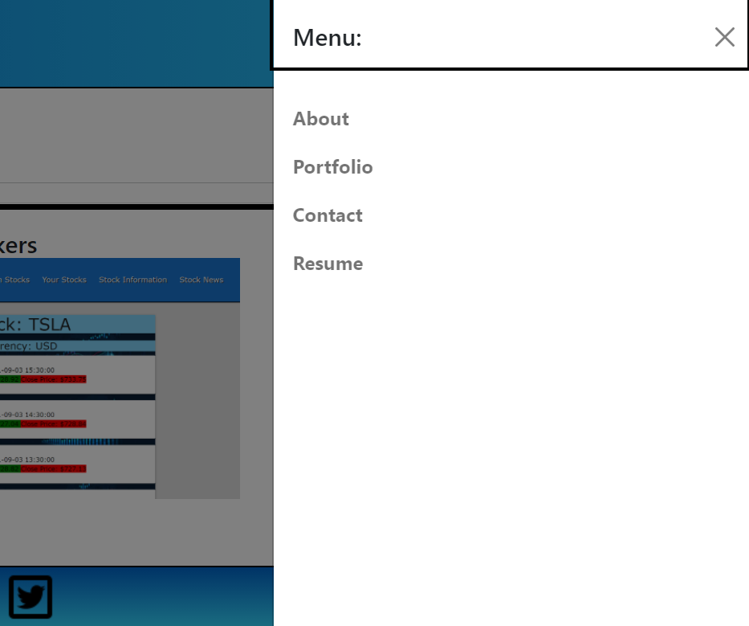

# React Portfolio SMM

This is a react-based application that showcases my portfolio!

## Description 

This application uses the react framework, and it was my first time using this framework. I plan to revisit in the near future to implement a better presentation and use Animate.css!

## Table of Contents 
* [Deploy](#deploy)
* [Technologies Used](#technologies-used)
* [Usage](#usage)
* [Contributions](#contributions)
* [License](#license)

## Deploy

[React Portfolio SMM](https://imaparadox.github.io/react-portfolio-smm/)

## Technologies Used

* 
* 
* 
* 
* 
* 

## Usage 

NOTE: Because of my footer, the particular extension I'm using to take screen shots refuses to showcase the entire page. Will return later to fix if possible.

### Landing:

The landing also doubles as About Me component.

### Navigation:

Collapsible navbar.

### Portfolio:

User will see a section with deployed links to my projects and respective GitHub repositories.

### Contact Me:

User can click the link to directly email me

### Resume:

User can click the link to view my resume.

## Contributions

N/A

## License

MIT License

© 2021 React Portfolio SMM Inc.

Permission is hereby granted, free of charge, to any person obtaining a copy
of this software and associated documentation files (the "Software"), to deal
in the Software without restriction, including without limitation the rights
to use, copy, modify, merge, publish, distribute, sublicense, and/or sell
copies of the Software, and to permit persons to whom the Software is
furnished to do so, subject to the following conditions:

The above copyright notice and this permission notice shall be included in all
copies or substantial portions of the Software.

THE SOFTWARE IS PROVIDED "AS IS", WITHOUT WARRANTY OF ANY KIND, EXPRESS OR
IMPLIED, INCLUDING BUT NOT LIMITED TO THE WARRANTIES OF MERCHANTABILITY,
FITNESS FOR A PARTICULAR PURPOSE AND NONINFRINGEMENT. IN NO EVENT SHALL THE
AUTHORS OR COPYRIGHT HOLDERS BE LIABLE FOR ANY CLAIM, DAMAGES OR OTHER
LIABILITY, WHETHER IN AN ACTION OF CONTRACT, TORT OR OTHERWISE, ARISING FROM,
OUT OF OR IN CONNECTION WITH THE SOFTWARE OR THE USE OR OTHER DEALINGS IN THE
SOFTWARE.
